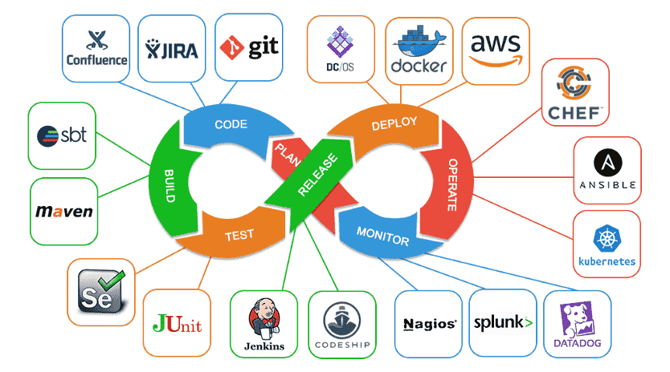

# CI/CD/CD Process

<<<<<<< HEAD
CI/CD - this process automates delivery and deployment of an application/ software to a client.
The CI/CD pipeline is one of the best practices for devops teams to implement, for delivering code changes more frequently and reliably

=======
CI/CD - this is a process to automate deployment and delivery of code that has been developed.

>>>>>>> 2dd8640b0565481707a68d7e6f4b23d8acdb02fe
1. You have your application available on your local host
2. You SSH into your GitHub repository
3. GitHub has a Webhook which listens for changes to the repository.
4. Jenkin automates the CI/CD process.
5. Anytime changes are made/ code is devloped these get pushed to GitHub and passed through Jenkins.
- Steps 1-5 are part of the CI-Continuous Integration process
- Technical goal of CI is to establish a consistent and automated way to build, package, and test applications.
- With consistency in the integration process, teams are more likely to commit code changes more frequently, leading to better collaboration and software quality.

6. Then we have the Agent Node which will run all the automated tests on this code.
7. Because there may be many testers testing code we do this on the agent node.
8. Then we push this to Master Node, where we will use scp to transfer the data from the local host to the remote host in AWS. i.e we want to push it to the cloud.
- Steps 6-8 are part of CD-Continuous delivery- we are putting things in the pre-production environment after it has been tested.
- Continuous delivery picks up where continuous integration ends. 
- CD automates the delivery of applications to selected infrastructure environments. 
- There are multiple environments other than production environment, i.e. development and testing environments, so CD provides an automated way to push code changes to these environments.

9. The we will push from the pre-production environment to the live environment on the cloud in aws.
- Step 9. Is reffered to as CD- continuous deployment.

- Continuous integration and continuous delivery require continuous testing because the objective is to deliver quality applications and code to users. 
- Continuous testing is often implemented as a set of automated regression, performance, and other tests that are executed in the CI/CD pipeline.

# Best Practices of CI/CD
1. ** Commit early, commit often ** : (pushed to git, ensures changes can be tracked and reverted if need be).
2. ** Keep the Builds green ** : (automated tests should pass- instance feedback to developers about their changes).
3. ** Build only once ** : (new build for each stage)
4. ** Streamline tests ** : (dont test for every eventuality, ensure performance of tests gives rapid feedback, while giving test coverage).
5. ** Clean your envionments ** : (clean up pre-production environments between each deployment so it is easy to keep track of configuration changes).
6. ** Monitor and measure your pipilines ** : (track speeds of deployment and monitor if they are taking longer, if they are implement performance optimisations).
7. ** Make it a team effort ** : (breaking down silos, gives everyone visibility of the end-to-end process).

# Tools used in the CI/CD pipeline

## Key Different between Delivery and Deployment
** Continuous Delivery : ** 
- extension of CI, automatically deploys all code changes to testing/ production environment after build stage.
- So on top of automated testing, you have an automated release process and you can deploy your application any time by clicking a button. 

** Continuous Deployment : ** 
- goes one step further than continuous delivery. Every change that passes all stages of the production pipeline is released to customers. 
- No human intervention, any failed test will prevent a new change to be deployed to production (live) environment.
