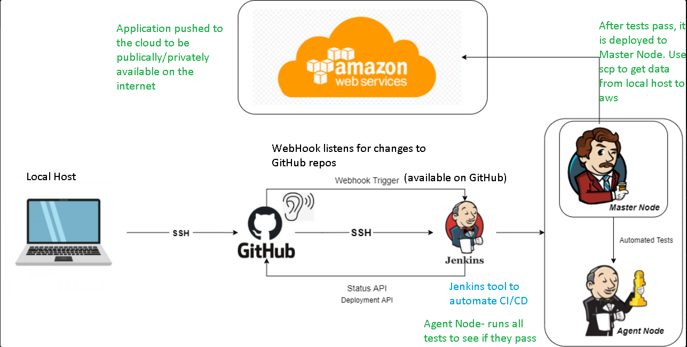
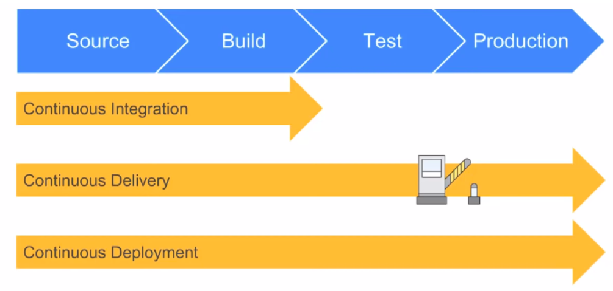

# CI/CD/CD Process

CI/CD - this is a process to automate deployment and delivery of code that has been developed.

1. You have your application available on your local host
2. You SSH into your GitHub repository
3. GitHub has a Webhook which listens for changes to the repository.
4. Jenkin automates the CI/CD process.
5. Anytime changes are made/ code is devloped these get pushed to GitHub and passed through Jenkins.
- Steps 1-5 are part of the CI-Continuous Integration process i.e source code is built and pushed.

6. Then we have the Agent Node which will run all the automated tests on this code.
7. Because there may be many testers testing code we do this on the agent node.
8. Then we push this to Master Node, where we will use scp to transfer the data from the local host to the remote host in AWS. i.e we want to push it to the cloud.
- Steps 6-8 are part of CD-Continuous delivery- we are putting things in the pre-production environment after it has been tested.

9. The we will push from the pre-production environment to the live environment on the cloud in aws.
- Step 9. Is reffered to as CD- continuous deployment.

